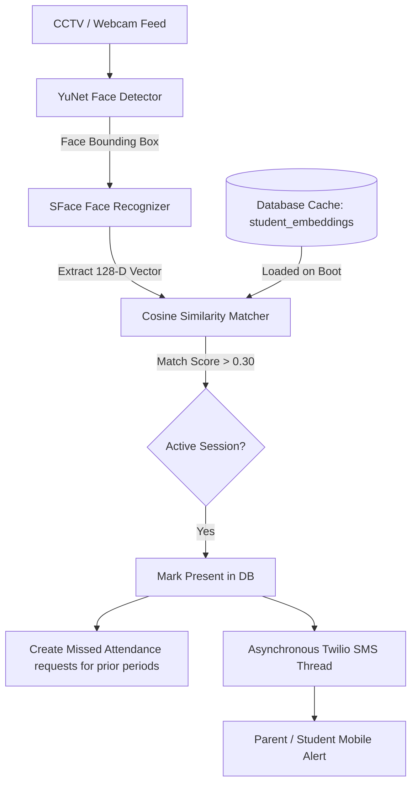

# Presentation Guide: Smart CCTV Attendance System

This document provides a copy-pasteable prompt for AI slide generators (like ChatGPT, Gamma, Tome, or Microsoft Copilot) and a slide-by-slide script containing slide content, structural diagrams, and explanations.

---

## 🤖 Part 1: AI Prompt for PPT Generation

Copy and paste the prompt below into any LLM (ChatGPT, Claude, Gemini, etc.) to generate the code (e.g., Python-PPTX or VBA) or directly generate slides in AI design software (like Gamma.app):

```text
Act as a Senior AI Solutions Architect. Create a professional, academic, and technical presentation outline for a final year engineering project. The presentation theme must look premium, modern, and tech-driven (Dark mode theme: Charcoal/Slate Gray background, Emerald Green/Cyan accents, clean typography).

Project Title: Smart CCTV Attendance System: Real-Time Face Recognition & Automated Twilio SMS Notification
Domain: Computer Vision, Deep Learning, and Smart Campus Automation

Generate 12 slides. For each slide, output:
1. Slide Title (bold, clear)
2. Slide Content (3-4 bullet points, highly technical and detailed, no placeholders)
3. Graphic/Visual Suggestion (description of diagram, layout, or screenshot to insert)
4. Speaker Notes (a paragraph explaining exactly what to say to the presentation guide)

The headings of the 12 slides MUST be exactly:
1. Title
2. Domain
3. Abstract
4. Literature Survey
5. Existing System
6. Proposed System
7. Architecture Diagram
8. System Requirements
9. System Design
10. System Implementation
11. Output Screenshot Description
12. Conclusion and Future Enhancement
```

---

## 📊 Part 2: Slide-by-Slide Content & Explanations

### Slide 1: Title
*   **Slide Title**: Smart CCTV Attendance System with AI Face Recognition & Twilio SMS Alerts
*   **Subtitle**: A Deep Learning & Computer Vision Solution for Smart Campus Automation
*   **Slide Content**:
    *   **Student Presenter**: Vinuthna Vasanthi
    *   **Institution**: Department of Computer Science & Engineering
    *   **Key Highlights**: OpenCV DNN, SFace Embedding Cache, Real-Time SMS Notifications, Missed Attendance Workflow.
*   **Visual**: A high-tech background featuring a CCTV lens overlay and neural network nodes.
*   **Explanation**: This is the introduction slide. State the title of the project and mention that this is an end-to-end contactless attendance automation system designed to eliminate manual tracking, speed up classroom roll calls, and keep parents updated in real-time.

---

### Slide 2: Domain
*   **Slide Title**: Technical Domain & Technologies
*   **Slide Content**:
    *   **Primary Domain**: Computer Vision (CV) & Deep Learning (DL)
    *   **Core Frameworks**: OpenCV DNN (YuNet for Face Detection, SFace for Feature Extraction)
    *   **Database Management**: PostgreSQL / SQLite hybrid caching layer
    *   **Notification Engine**: Twilio Programmable SMS API (asynchronous dispatch)
*   **Visual**: Icons representing Python, OpenCV, PostgreSQL, and Twilio.
*   **Explanation**: The domain is Computer Vision and Artificial Intelligence. Explain that instead of using heavy frameworks (like dlib or heavy PyTorch models) which lag on local webcams or edge CPUs, this system utilizes lightweight, production-grade DNN models optimized for real-time edge processing.

---

### Slide 3: Abstract
*   **Slide Title**: Abstract
*   **Slide Content**:
    *   **Objective**: Develop a high-speed, contactless classroom attendance system that identifies faces and alerts parents in under 3 seconds.
    *   **Methodology**: Integrates YuNet for face detection and SFace (FaceRecognizerSF) to extract 128-dimensional biometric embeddings.
    *   **Optimization**: Embeddings are pre-computed and stored in a database cache, avoiding repetitive disk-scans and model inference on start.
    *   **Asynchronous Alerts**: Triggers instant SMS updates to verified guardian numbers concurrently, eliminating UI freeze.
*   **Visual**: A summary infographic showing: Camera Feed ➡️ AI Face Match ➡️ Attendance Logged ➡️ SMS Sent.
*   **Explanation**: The system captures frames, detects faces using YuNet, and generates 128-D vector embeddings via SFace. The vector is compared against a pre-compiled database cache using cosine similarity. If the score exceeds 0.30, the student is marked present, and an SMS notification is dispatched on a separate background thread.

---

### Slide 4: Literature Survey
*   **Slide Title**: Literature Survey
*   **Slide Content**:
    *   **Haar-Cascades & LBPH**: Extremely sensitive to lighting changes and pose variations. High false positive rates.
    *   **Dlib (ResNet/HOG)**: High CPU footprint, slow loading (15-20 seconds on boot), lags on standard computer processors.
    *   **YuNet & SFace (OpenCV Zoo)**: State-of-the-art dual-model architecture optimized for CPU and edge hardware. Loads in milliseconds and matches faces within 100ms.
*   **Visual**: A comparison table showing Haar-Cascades, Dlib, and OpenCV DNN (YuNet+SFace) on metrics like Speed, Accuracy, and Lighting Tolerance.
*   **Explanation**: Explain that traditional systems relied on Haar-Cascades (prone to false matches in dark classrooms) or heavy Dlib models (which freeze lower-end systems). Our system utilizes YuNet + SFace which provides deep learning accuracy with edge-optimized lightweight performance.

---

### Slide 5: Existing System
*   **Slide Title**: Existing System Analysis & Drawbacks
*   **Slide Content**:
    *   **Manual Paper Registers**: Consumes valuable lecture time (5-10 mins/hour), prone to errors, and open to proxy logs.
    *   **Physical Biometrics (Fingerprint)**: Causes queuing bottlenecks at doors, raises hygiene concerns, and requires hardware maintenance.
    *   **RFID Card Systems**: Highly susceptible to proxy marking where students carry cards for absent peers.
    *   **Lack of Notification**: No instant communication channels to alert parents of student absence or attendance status.
*   **Visual**: Cross marks next to images representing a manual attendance registry sheet, a fingerprint scanner, and RFID cards.
*   **Explanation**: Highlight the vulnerabilities of current systems. The manual sheet is insecure, fingerprints create massive queues at classroom entrances, and RFID cards are easily handed over. Furthermore, none of these systems automate notifications for parents.

---

### Slide 6: Proposed System
*   **Slide Title**: Proposed Smart CCTV Attendance System
*   **Slide Content**:
    *   **Contactless & Non-Intrusive**: Captures faces dynamically from a webcam or RTSP classroom camera feed.
    *   **Database Caching Optimization**: Face embeddings are cached in PostgreSQL/SQLite on first boot. Startup training takes milliseconds.
    *   **Session Management**: Active sessions enforce a unique constraint, allowing marking only once per lecture but supporting subsequent sessions.
    *   **Automated SMS Discrepancy Workflows**: Triggers multithreaded Twilio alerts. Auto-generates missed attendance requests if a student is absent.
*   **Visual**: Checkmarks next to: Face Scanning, Database Cache, Multithreaded SMS, and Missed Request Dashboard.
*   **Explanation**: The proposed solution uses non-intrusive cameras to mark attendance. It utilizes database caching to load known faces in milliseconds. By keeping the UI separate from background SMS dispatch threads, we prevent freezing and lag.

---

### Slide 7: Architecture Diagram
*   **Slide Title**: System Architecture & Data Flow
*   **Slide Content**:
    *   **Data Flow**: BGR Frame Capture ➡️ Face Bounding Box (YuNet) ➡️ 128-D Embedding (SFace) ➡️ Cosine Similarity Match.
    *   **Resolution Engine**: Checks database cache. If matched, checks active session constraints.
    *   **Notification Dispatch**: Triggers asynchronous Twilio thread and locks the student in the session cooldown cache.
*   **Visual**:

*   **Explanation**: Walk the guide through the diagram. The feed passes frames to YuNet, which isolates faces. SFace crops and generates a vector. This vector is compared to the database-cached vectors using Cosine Similarity. If a match is found, the system registers the attendance in PostgreSQL and spawns a background thread to send the SMS message.

---

### Slide 8: System Requirements
*   **Slide Title**: Hardware & Software Requirements
*   **Slide Content**:
    *   **Hardware Requirements**:
        *   Camera: HD 1080p Webcam or RTSP IP CCTV Camera.
        *   Processor: Intel Core i5 (8th Gen or above) / AMD Ryzen 5.
        *   Memory: 8 GB RAM minimum.
    *   **Software Requirements**:
        *   Operating System: Windows 10/11 or Ubuntu.
        *   Language: Python 3.10 / 3.13.
        *   Database: PostgreSQL 14+ (or SQLite fallback).
        *   APIs: Twilio REST API.
*   **Visual**: Split-screen listing Hardware on the left and Software/Libraries on the right.
*   **Explanation**: Highlight that the hardware footprint is minimal because the AI models are lightweight. On the software side, explain that the project is built on Python, Flask, and PostgreSQL.

---

### Slide 9: System Design
*   **Slide Title**: Database ER Diagram & Schema Design
*   **Slide Content**:
    *   **students**: Stores student bio-data, roll numbers, and contact info (primary key `student_id`).
    *   **student_embeddings**: Stores high-dimensional `128-D` SFace vectors mapped to student IDs.
    *   **attendance_sessions**: Manages active sessions (`session_id`, `start_time`, `is_active`).
    *   **attendance**: Enforces unique composite key `(student_id, session_id)` to prevent duplicate markings.
    *   **missed_attendance_requests**: Logs discrepancies for manual review.
*   **Visual**: ER diagram showing relationships: `students` 1-to-many `attendance`, `attendance_sessions` 1-to-many `attendance`, `students` 1-to-many `student_embeddings`.
*   **Explanation**: Show how data integrity is maintained. The `attendance` table uses a foreign key pointing to `attendance_sessions`, and an active session unique constraint prevents double marking.

---

### Slide 10: System Implementation
*   **Slide Title**: Modular Code Implementation
*   **Slide Content**:
    *   **`ai_engine`**: Houses YuNet and SFace model loaders, real-time cameras, and face log-in controllers.
    *   **`database`**: Handles raw SQL executions, connection pooling, and binary vector reading/writing.
    *   **`notifications`**: Controls Twilio REST API interactions, phone number normalization, and verification checks.
    *   **`backend/routes`**: Exposes JSON REST APIs for live web socket stats, ending sessions, and face log-in checks.
*   **Visual**: Code folder structure screenshot or graphic.
*   **Explanation**: Explain the modularity of the code. We separate the AI engine from the backend web server and the database queries, ensuring high clean-code standard (MVC architecture).

---

### Slide 11: Output Screenshots
*   **Slide Title**: System Interface & Live Output
*   **Slide Content**:
    *   **Admin/Mentor Dashboard**: Beautiful dark-mode UI with live webcam feed, stats cards showing student present count, and active session status.
    *   **Face Recognition Feed**: Live video stream displaying emerald-green bounding boxes and labeled names of recognized students.
    *   **Twilio SMS Alert**: Mobile screenshot displaying the automated notification: `"your attendance is marked for P1"`.
    *   **Missed Attendance Panel**: Grid showing pending reviews for students who missed previous lectures.
*   **Visual**: Placeholders to insert: (1) Live feed bounding box image, (2) Twilio SMS screenshot, (3) Dashboard panel.
*   **Explanation**: Walk the guide through the screens. Detail how the live green bounding boxes indicate successful matching, how the dashboard refreshes in real-time, and show the exact SMS message received on the mobile phone.

---

### Slide 12: Conclusion & Future Enhancement
*   **Slide Title**: Conclusion & Future Scope
*   **Slide Content**:
    *   **Conclusion**: Successfully designed a contactless attendance system matching faces in under 3 seconds and sending real-time SMS updates with zero startup delay.
    *   **Future Enhancement - Multi-Camera RTSP**: Aggregate streams from multiple cameras across a campus.
    *   **Future Enhancement - Anti-Spoofing**: Integrate 3D liveness detection to prevent photo-presentation attacks.
    *   **Future Enhancement - Edge Compute**: Compile and port model executables to run directly on Raspberry Pi edge devices.
*   **Visual**: Visual icons indicating Multi-Camera streams, a shield (Security/Anti-Spoofing), and a microchip (Edge Computing).
*   **Explanation**: Conclude the presentation by highlighting that the core issues of traditional attendance systems have been solved. End with the future enhancements showing how this system can be scaled up to a campus-wide multi-camera setup.
